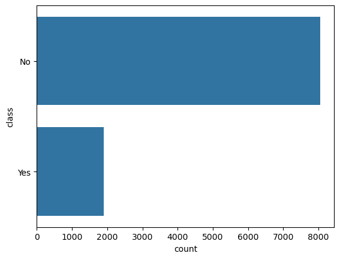
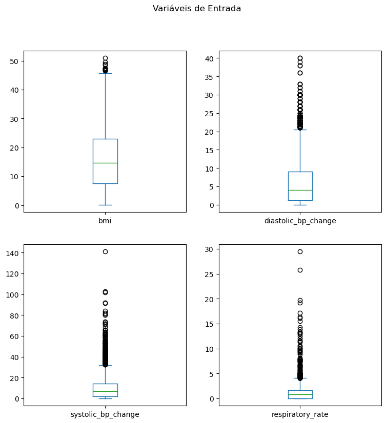
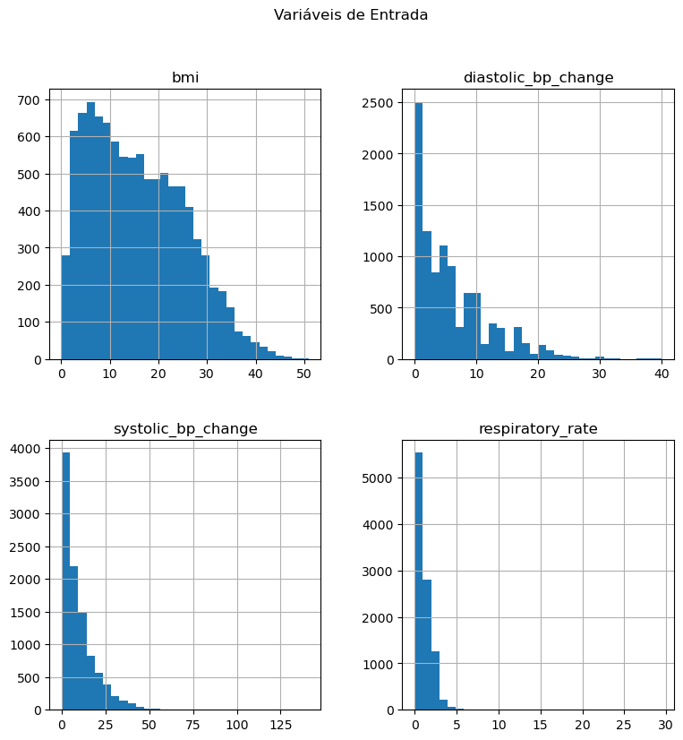

## Carga e Preparação dos Dados


```python
# Versão da Linguagem Python
from platform import python_version
print(python_version())
```

    3.10.14


```python
# Imports
import random
import sagemaker
import pandas as pd
import pylab as pl
import matplotlib.pyplot as plt
from matplotlib import cm
import seaborn as sns
from sklearn.preprocessing import LabelEncoder, StandardScaler
from sklearn.model_selection import train_test_split
%matplotlib inline
import warnings
warnings.simplefilter(action="ignore", category=FutureWarning)
```

    sagemaker.config INFO - Not applying SDK defaults from location: /etc/xdg/sagemaker/config.yaml
    sagemaker.config INFO - Not applying SDK defaults from location: /home/sagemaker-user/.config/sagemaker/config.yaml


## Carga e Preparação dos Dados


```python
from sagemaker import get_execution_role
role = get_execution_role()
print(role)
```

    arn:aws:iam::043309322885:role/service-role/AmazonSageMaker-ExecutionRole-20240911T133604


```python
s3_bucket = 'eduardo-project-medical-data'    #nome do seu bucket
prefix = 'dados'   #diretorio dos arquivos
```


```python
raiz = 's3://{}/{}/'.format(s3_bucket, prefix)
print(raiz)
```

    s3://eduardo-project-medical-data/dados/


```python
df = pd.read_csv(raiz + 'dataset.csv') #nota importante, é necessário instalar o s3fs para acessar S3, melhor mudar a máquina de medium para alguma melhor, pois a instalação é lento com 4GB de RAM.
#instalar pelo PIP não funciona, precisa instalar pelo conda também "!conda install..."
```


```python
df.head()    #para ver as primeiras linhas da tabela, ou "cabeça" / to see the fisrts lines in the table or "head" 
```


<div>
<style scoped>
    .dataframe tbody tr th:only-of-type {
        vertical-align: middle;
    }

    .dataframe tbody tr th {
        vertical-align: top;
    }

    .dataframe thead th {
        text-align: right;
    }
</style>
<table border="1" class="dataframe">
  <thead>
    <tr style="text-align: right;">
      <th></th>
      <th>class</th>
      <th>bmi</th>
      <th>diastolic_bp_change</th>
      <th>systolic_bp_change</th>
      <th>respiratory_rate</th>
    </tr>
  </thead>
  <tbody>
    <tr>
      <th>0</th>
      <td>No</td>
      <td>16.192875</td>
      <td>14.000000</td>
      <td>19.000000</td>
      <td>2.146700</td>
    </tr>
    <tr>
      <th>1</th>
      <td>No</td>
      <td>13.383857</td>
      <td>4.000000</td>
      <td>3.000000</td>
      <td>0.000000</td>
    </tr>
    <tr>
      <th>2</th>
      <td>No</td>
      <td>28.554000</td>
      <td>6.000000</td>
      <td>12.000000</td>
      <td>2.065591</td>
    </tr>
    <tr>
      <th>3</th>
      <td>No</td>
      <td>3.536667</td>
      <td>5.725649</td>
      <td>1.635738</td>
      <td>0.571832</td>
    </tr>
    <tr>
      <th>4</th>
      <td>No</td>
      <td>16.561000</td>
      <td>11.451297</td>
      <td>8.728523</td>
      <td>2.099426</td>
    </tr>
  </tbody>
</table>
</div>


```python
df.shape     #para ver shape formato dos dados, nesse caso 5 colunas e 9948 linhas  / to view the data format or "shape" in this case 5 colums and 9948 lines
```


    (9948, 5)


## Análise Exploratória


```python
df.describe()
```


<div>
<style scoped>
    .dataframe tbody tr th:only-of-type {
        vertical-align: middle;
    }

    .dataframe tbody tr th {
        vertical-align: top;
    }

    .dataframe thead th {
        text-align: right;
    }
</style>
<table border="1" class="dataframe">
  <thead>
    <tr style="text-align: right;">
      <th></th>
      <th>bmi</th>
      <th>diastolic_bp_change</th>
      <th>systolic_bp_change</th>
      <th>respiratory_rate</th>
    </tr>
  </thead>
  <tbody>
    <tr>
      <th>count</th>
      <td>9948.000000</td>
      <td>9948.000000</td>
      <td>9948.000000</td>
      <td>9948.000000</td>
    </tr>
    <tr>
      <th>mean</th>
      <td>15.732258</td>
      <td>5.881994</td>
      <td>9.591503</td>
      <td>1.021472</td>
    </tr>
    <tr>
      <th>std</th>
      <td>9.703593</td>
      <td>5.896722</td>
      <td>10.371288</td>
      <td>1.231041</td>
    </tr>
    <tr>
      <th>min</th>
      <td>0.122124</td>
      <td>0.000000</td>
      <td>0.000000</td>
      <td>0.000000</td>
    </tr>
    <tr>
      <th>25%</th>
      <td>7.455795</td>
      <td>1.225649</td>
      <td>2.000000</td>
      <td>0.000000</td>
    </tr>
    <tr>
      <th>50%</th>
      <td>14.613946</td>
      <td>4.000000</td>
      <td>6.728523</td>
      <td>0.836660</td>
    </tr>
    <tr>
      <th>75%</th>
      <td>22.918650</td>
      <td>9.000000</td>
      <td>14.000000</td>
      <td>1.634458</td>
    </tr>
    <tr>
      <th>max</th>
      <td>50.900000</td>
      <td>40.000000</td>
      <td>141.000000</td>
      <td>29.444864</td>
    </tr>
  </tbody>
</table>
</div>


```python
sns.countplot(df['class'], label = 'Count')
plt.show()
```


    

    


```python
df.plot(kind = 'box', subplots = True, layout = (2,2), sharex = False, sharey = False, figsize = (9,9), 
        title = 'Variáveis de Entrada')
plt.show()
```


    

    


```python
df.hist(bins = 30, figsize = (9,9))
pl.suptitle("Variáveis de Entrada")
plt.show()
```


    

    


## Pré-Processamento dos Dados


```python
X = df[['bmi', 'diastolic_bp_change', 'systolic_bp_change', 'respiratory_rate']]
y = df['class']
```


```python
# Encoder
label_encoder = LabelEncoder()
label_encoder.fit(['Yes', 'No'])
y = label_encoder.transform(y)
```


```python
y
```


    array([0, 0, 0, ..., 0, 0, 0])


```python
# Divisão em dados de treino e teste
X_treino, X_teste, y_treino, y_teste = train_test_split(X, y, random_state = 123)
```


```python
X_treino.shape
```


    (7461, 4)


```python
X_teste.shape
```


    (2487, 4)


```python
# Padronização
scaler = StandardScaler()
X_treino = scaler.fit_transform(X_treino)
X_teste = scaler.transform(X_teste)
```


```python
# Dataframe de treino
X_treino = pd.DataFrame(X_treino, columns = ['bmi', 'diastolic_bp_change', 'systolic_bp_change', 'respiratory_rate'])
y_treino = pd.DataFrame(y_treino, columns = ['class'])
df_treino = pd.concat([y_treino, X_treino], axis = 1)
df_treino.head()
```


<div>
<style scoped>
    .dataframe tbody tr th:only-of-type {
        vertical-align: middle;
    }

    .dataframe tbody tr th {
        vertical-align: top;
    }

    .dataframe thead th {
        text-align: right;
    }
</style>
<table border="1" class="dataframe">
  <thead>
    <tr style="text-align: right;">
      <th></th>
      <th>class</th>
      <th>bmi</th>
      <th>diastolic_bp_change</th>
      <th>systolic_bp_change</th>
      <th>respiratory_rate</th>
    </tr>
  </thead>
  <tbody>
    <tr>
      <th>0</th>
      <td>0</td>
      <td>-1.483765</td>
      <td>-1.003436</td>
      <td>-0.927406</td>
      <td>-0.817379</td>
    </tr>
    <tr>
      <th>1</th>
      <td>1</td>
      <td>0.947850</td>
      <td>-1.003436</td>
      <td>-0.927406</td>
      <td>-0.662177</td>
    </tr>
    <tr>
      <th>2</th>
      <td>0</td>
      <td>-1.034765</td>
      <td>2.206180</td>
      <td>2.057467</td>
      <td>-0.817379</td>
    </tr>
    <tr>
      <th>3</th>
      <td>0</td>
      <td>-1.406122</td>
      <td>0.179054</td>
      <td>-0.445975</td>
      <td>-0.817379</td>
    </tr>
    <tr>
      <th>4</th>
      <td>0</td>
      <td>0.366195</td>
      <td>-0.665582</td>
      <td>0.228029</td>
      <td>-0.431359</td>
    </tr>
  </tbody>
</table>
</div>


```python
# Dataframe de teste
X_teste = pd.DataFrame(X_teste, columns = ['bmi', 'diastolic_bp_change', 'systolic_bp_change', 'respiratory_rate'])
y_teste = pd.DataFrame(y_teste, columns = ['class'])
df_teste = pd.concat([y_teste, X_teste], axis=1)
df_teste.head()
```


<div>
<style scoped>
    .dataframe tbody tr th:only-of-type {
        vertical-align: middle;
    }

    .dataframe tbody tr th {
        vertical-align: top;
    }

    .dataframe thead th {
        text-align: right;
    }
</style>
<table border="1" class="dataframe">
  <thead>
    <tr style="text-align: right;">
      <th></th>
      <th>class</th>
      <th>bmi</th>
      <th>diastolic_bp_change</th>
      <th>systolic_bp_change</th>
      <th>respiratory_rate</th>
    </tr>
  </thead>
  <tbody>
    <tr>
      <th>0</th>
      <td>0</td>
      <td>-0.940089</td>
      <td>-0.403964</td>
      <td>-0.279542</td>
      <td>-0.817379</td>
    </tr>
    <tr>
      <th>1</th>
      <td>0</td>
      <td>-0.502614</td>
      <td>-0.665582</td>
      <td>0.131742</td>
      <td>-0.362450</td>
    </tr>
    <tr>
      <th>2</th>
      <td>0</td>
      <td>1.078473</td>
      <td>0.347981</td>
      <td>0.228029</td>
      <td>-0.817379</td>
    </tr>
    <tr>
      <th>3</th>
      <td>1</td>
      <td>-0.636164</td>
      <td>-0.251491</td>
      <td>0.587034</td>
      <td>-0.817379</td>
    </tr>
    <tr>
      <th>4</th>
      <td>1</td>
      <td>-0.528479</td>
      <td>2.037253</td>
      <td>1.383463</td>
      <td>0.185934</td>
    </tr>
  </tbody>
</table>
</div>


```python
# Dataframe para batch normalization
batch_teste_df = df_teste.drop(['class'], axis = 1)
batch_teste_df.head()
```


<div>
<style scoped>
    .dataframe tbody tr th:only-of-type {
        vertical-align: middle;
    }

    .dataframe tbody tr th {
        vertical-align: top;
    }

    .dataframe thead th {
        text-align: right;
    }
</style>
<table border="1" class="dataframe">
  <thead>
    <tr style="text-align: right;">
      <th></th>
      <th>bmi</th>
      <th>diastolic_bp_change</th>
      <th>systolic_bp_change</th>
      <th>respiratory_rate</th>
    </tr>
  </thead>
  <tbody>
    <tr>
      <th>0</th>
      <td>-0.940089</td>
      <td>-0.403964</td>
      <td>-0.279542</td>
      <td>-0.817379</td>
    </tr>
    <tr>
      <th>1</th>
      <td>-0.502614</td>
      <td>-0.665582</td>
      <td>0.131742</td>
      <td>-0.362450</td>
    </tr>
    <tr>
      <th>2</th>
      <td>1.078473</td>
      <td>0.347981</td>
      <td>0.228029</td>
      <td>-0.817379</td>
    </tr>
    <tr>
      <th>3</th>
      <td>-0.636164</td>
      <td>-0.251491</td>
      <td>0.587034</td>
      <td>-0.817379</td>
    </tr>
    <tr>
      <th>4</th>
      <td>-0.528479</td>
      <td>2.037253</td>
      <td>1.383463</td>
      <td>0.185934</td>
    </tr>
  </tbody>
</table>
</div>


```python
# Salva os dados processados no S3
df_treino.to_csv(raiz + 'treino.csv', header = False, index = False)
df_treino.to_csv(raiz + 'treino_with_header.csv', header = True, index = False)
df_teste.to_csv(raiz + 'teste.csv', header = False, index = False)
batch_teste_df.to_csv(raiz + 'batch_teste.csv', header = False, index = False)
```

## Dados Sintéticos Para Simulação


```python
def get_random_val():
    val = random.uniform(0, 1)
    return round(val, 6)
```


```python
def generate_row():
    row = []
    for _ in range(4):
        row.append(get_random_val())
    return row  
```


```python
def generate_dataset():
    rows = []
    for _ in range(20):
        rows.append(generate_row())
    return rows 
```


```python
rows = generate_dataset() 
```


```python
df = pd.DataFrame(rows, columns = ['bmi', 'diastolic_bp_change', 'systolic_bp_change', 'respiratory_rate'])
```


```python
df.head()
```


<div>
<style scoped>
    .dataframe tbody tr th:only-of-type {
        vertical-align: middle;
    }

    .dataframe tbody tr th {
        vertical-align: top;
    }

    .dataframe thead th {
        text-align: right;
    }
</style>
<table border="1" class="dataframe">
  <thead>
    <tr style="text-align: right;">
      <th></th>
      <th>bmi</th>
      <th>diastolic_bp_change</th>
      <th>systolic_bp_change</th>
      <th>respiratory_rate</th>
    </tr>
  </thead>
  <tbody>
    <tr>
      <th>0</th>
      <td>0.493210</td>
      <td>0.191259</td>
      <td>0.473998</td>
      <td>0.540653</td>
    </tr>
    <tr>
      <th>1</th>
      <td>0.594619</td>
      <td>0.287505</td>
      <td>0.659932</td>
      <td>0.488602</td>
    </tr>
    <tr>
      <th>2</th>
      <td>0.996328</td>
      <td>0.590300</td>
      <td>0.412578</td>
      <td>0.858276</td>
    </tr>
    <tr>
      <th>3</th>
      <td>0.534422</td>
      <td>0.937581</td>
      <td>0.508359</td>
      <td>0.308100</td>
    </tr>
    <tr>
      <th>4</th>
      <td>0.093716</td>
      <td>0.140400</td>
      <td>0.322194</td>
      <td>0.918411</td>
    </tr>
  </tbody>
</table>
</div>


```python
df.to_csv(raiz + 'dados_sinteticos.csv', header = False, index = False)
```

## Fim


```python
!jupyter nbconvert --to markdown DataPrep.ipynb
```

    [NbConvertApp] Converting notebook DataPrep.ipynb to markdown
    [NbConvertApp] Support files will be in DataPrep_files/
    [NbConvertApp] Making directory DataPrep_files
    [NbConvertApp] Writing 22245 bytes to DataPrep.md


```python

```
