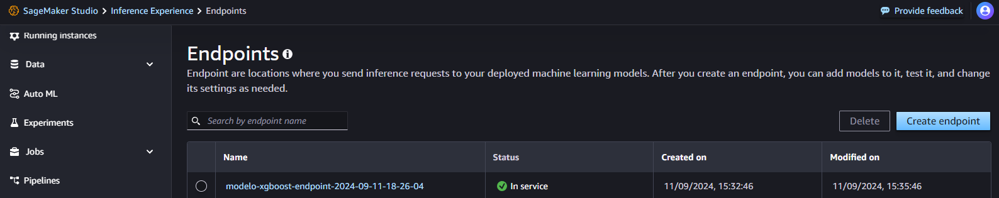

# Configuração do Endpoint

## Imports 


```python
from time import gmtime, strftime
import sagemaker
```


## Defining the objects


```python
current_timestamp = strftime("%Y-%m-%d-%H-%M-%S", gmtime()) 
sagemaker_session = sagemaker.session.Session()
```
It's a good practice to use this time stamp to creat a unique name.
É uma boa prática usar esse time stamp para criar um nome único em produção.

```python
TRAINING_JOB_NAME = 'classifier-2024-09-11-18-12-09-781'
```
In the "ModelXGBoost" we created a classifier that is stored in the S3.

```python
MODEL_NAME = f'modelo-xgboost-model-{current_timestamp}'
ENDPOINT_CONFIG_NAME = f'modelo-xgboost-endpoint-config-{current_timestamp}'
ENDPOINT_NAME = f'modelo-xgboost-endpoint-{current_timestamp}'
```
Bellow we see if all is correct. Abaixo verificamos se tudo está correto.

```python
TRAINING_JOB_NAME 
```


    'classifier-2024-09-11-18-12-09-781'


```python
MODEL_NAME
```


    'modelo-xgboost-model-2024-09-11-18-26-04'


```python
ENDPOINT_CONFIG_NAME
```


    'modelo-xgboost-endpoint-config-2024-09-11-18-26-04'


```python
ENDPOINT_NAME
```


    'modelo-xgboost-endpoint-2024-09-11-18-26-04'


## Cria o Modelo a Partir dos Artefatos
## Creating the model from the Artefatos/artifacts folder


```python
sagemaker_session.create_model_from_job(training_job_name = TRAINING_JOB_NAME, name = MODEL_NAME) 
```


    'modelo-xgboost-model-2024-09-11-18-26-04'


Lembre que training job name é a variavel que contém o classifier
Remember that our training job name is the variable that stores that classifier from S3
## Cria a Configuração do Endpoint

https://docs.aws.amazon.com/pt_br/sagemaker/latest/APIReference/API_CreateEndpoint.html


```python
sagemaker_session.create_endpoint_config(ENDPOINT_CONFIG_NAME, 
                                         model_name = MODEL_NAME, 
                                         initial_instance_count = 1, 
                                         instance_type = 'ml.m5.large')
```


    'modelo-xgboost-endpoint-config-2024-09-11-18-26-04'


Acima nós configuramos o endpoint usando um M5 Large, como usamos para o treinamento do XGB, mas nesse caso apenas uma instância.
Above we create the endpoint using the M5 Large, the same way we used for the treinig with the XGB, in this case only one instance is suficient.
## Cria um Novo Endpoint


```python
sagemaker_session.create_endpoint(ENDPOINT_NAME, ENDPOINT_CONFIG_NAME)
```

    -----! # this is the progress "bar"

    'modelo-xgboost-endpoint-2024-09-11-18-26-04' #genereted model


If  you go now to the "Endpoint" on SageMaker studio you will find this endpoint, like in the image bellow: 



Now you can use it to work with other applications on AWS, APIs, etc.

That's the end, thanks folks.
